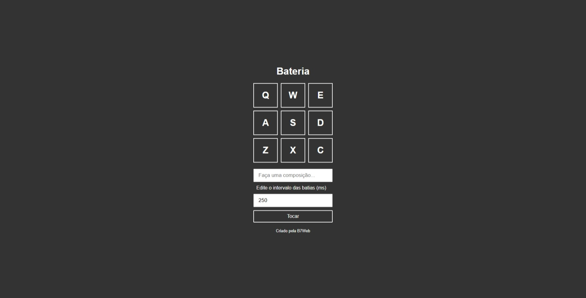
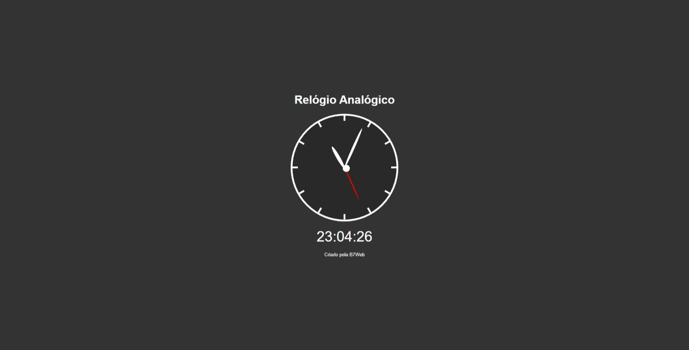
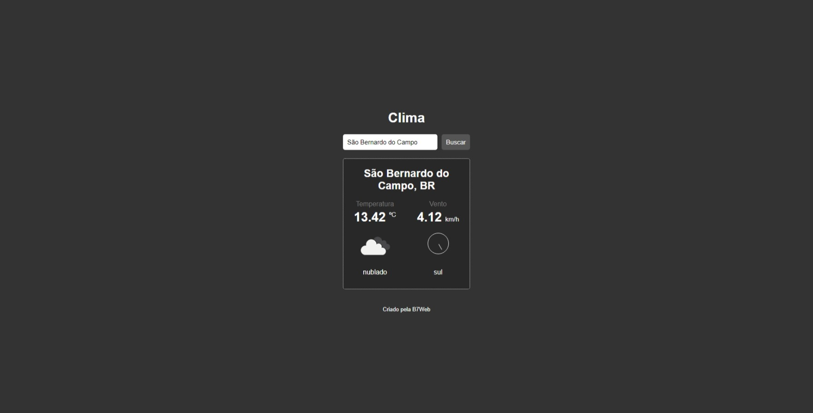
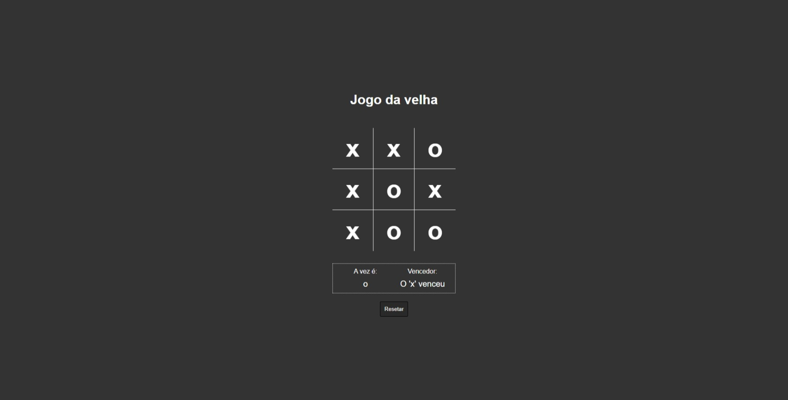
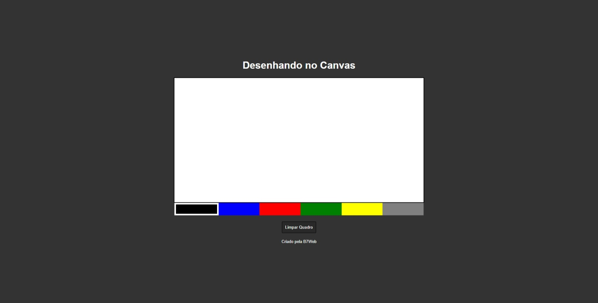
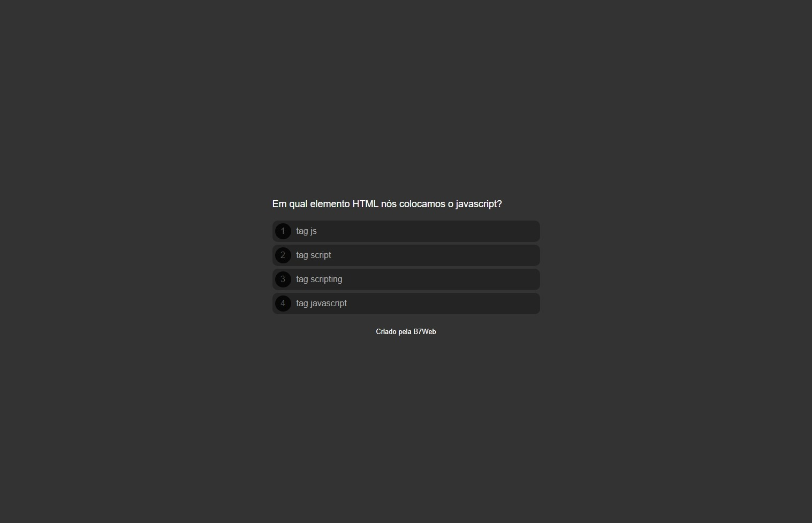
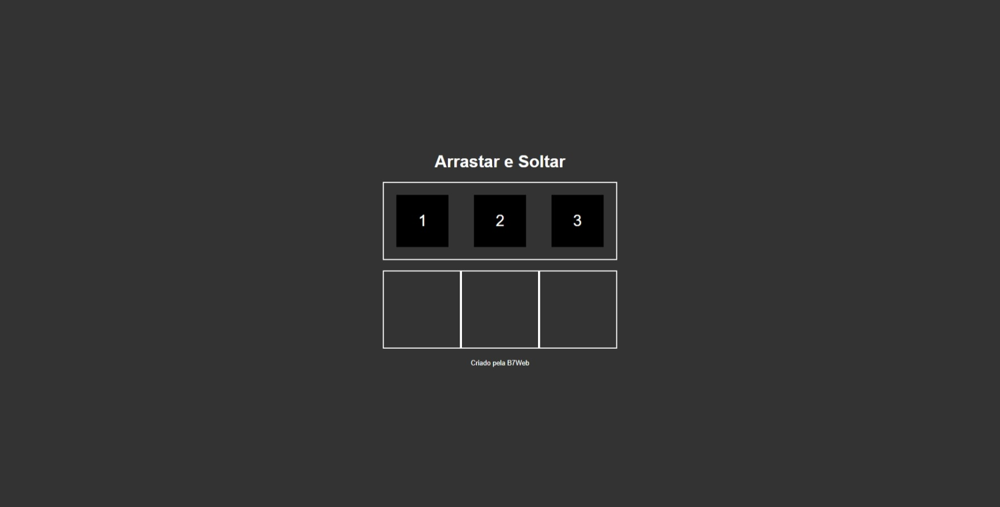

<h1 align="center">
  
		 
 7 days 7 projects
</h1>

<h3 align="center">
	7 projects to practice the vanilla js knowledge
</h3>

	
	
	

<h4 align="center">
	🚧 Done 🚀🚧
</h4>

# Table of contents

<!--ts-->

- [Table of contents](#table-of-contents)
  - [💻 About](#-about)
  - [⚙️ Features](#️-features)
  - [🚀 Preview](#-preview)
  - [💡 How it works](#-how-it-works)
  - [🛠 Tech stack](#-tech-stack)
  - [💪 How to contribute](#-how-to-contribute)
  <!--te-->

---

## 💻 About

Challenge from [B7Web - 7 projects in 7 days](https://b7web.com.br/), with some pretty projects to practice the logical thinking and js skills.

Personally i added some new features to challenge myself.

---

## ⚙️ Features

- [x] JavaScript
  - [x] DOM Manipulation
  - [x] Loops
  - [x] Events
  - [x] Functions
  - [x] Date manipulation
  - [x] API consuming
  - [x] Drag and drop events
- [x] Challenges
  - [x] Keyboard Drums
    - [x] Edit time interval
  - [x] Analog and digital clock
  - [x] Weather App
    - [x] Weather description and wind direction
  - [x] Tic tac toe game
  - [x] Drawing Canvas
  - [x] Quiz
  - [x] Drag and drop

---

## 🚀 Preview

|  |  |  |  |
| ------------------------------ | ------------------------------ | ------------------------------ | ------------------------------ |
|  |  |  |

---

## 💡 How it works

Each folder has a practical project, after cloning this repo, access the folder of the project and run the `index.html` file.

---

## 🛠 Tech stack

The following tools were used in the construction of the project:

- **HTML5**
- **CSS3**
- **JavaScript**

---

## 💪 How to contribute

1. Fork the project.
2. Create a new branch with your changes: `git checkout -b my-feature`
3. Save your changes and create a commit message telling you what you did: `git commit -m" feature: My new feature "`
4. Submit your changes: `git push origin my-feature`
   > If you have any suggestion, tip or compliment, please leave a issue

---

Made with love by Samyr Ribeiro 👋🏽 [Get in Touch!](https://www.linkedin.com/in/samyr-ribeiro-82a720145/)
